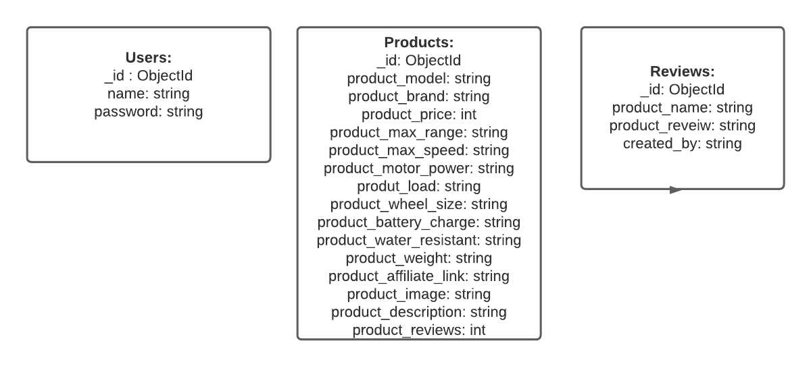

# Scooter Circle

 

[View the deployed project here](https://scooter-circle.herokuapp.com/)

I have created this site as part of my Milestone 3 project for Code Institute, 
focusing on Fulls Stack Frameworks using Python, Flask and Mongo DB, whilst performing a complete CRUD operation.

This app is for young adults between the age of 25-34, who are focused on environmentally friendly, easy to use and cost-effective personal transportation.

This website will enable the user to share their reviews, view other users reviews and find the best scooter based on their everyday needs.

# Table of Content

1 [**Project Goals**](#project-goals)

2 [**UX**](#ux)
   - [**User Goals**](#user-goals)
   - [**Scope**](#scope)

3 [**Structure of the app**](#structure-of-the-app)
   - [**View for a guest user**](#view-for-a-guest-user)
   - [**View for logged in user**](#view-for-logged-in-user) 
   - [**View for admin**](#view-for-admin)
   - [**User Stories**](#user-stories)
   - [**Business goals**](#business-goals)

4 [**User Requirements and Expectations**](#user-requirements-and-expectations)
   - [**Requirements**](#requirements)
   - [**Expectations**](#expectations)

5 [**Design**](#design)
   - [**Colour Scheme**](#colour-scheme)
   - [**Typography**](#typography)
   - [**Imagery**](#imagery)
   - [**Icons**](#icons)
   - [**Style**](#style)

6 [**Wireframes Flowchart and Data Model**](#wireframes-flowchart-and-data-model)
   - [**Wireframes**](#wireframes)
   - [**Database model**](#database-model)
   - [**Flow Chart**](#flow-chart)

7 [**Features**](#features)
   - [**All Pages**](#all-pages)
   - [**Home Page**](#home-page)
   - [**Registration Page**](#registration-page)
   - [**Login Page**](#login-page)
   - [**Profile Page**](#profile-page)
   - [**Edit Review**](#edit-review)
   - [**Products Page**](#products-page)
   - [**View Product**](#view-product) 
   - [**Add Product**](#add-product) 
   - [**Edit Product**](#edit-product) 
   - [**Contact Page**](#contact-page) 
   - [**404.html**](#404.html)
   - [**500.html**](#500.html)
   - [**Features Left to Implement**](#features-left-to-implement)

8 [**Technology Used**](#technology-used)
   - [**Languages Used**](#language-used)
   - [**Frameworks and Libraries**](#frameworks-and-libraries)
   - [**Tools**](#tools) 

9 [**Testing**](#testing)
   - [TESTING.md file](TESTING.md)

10 [**Deployment**](#deployment)
   - [**Local Deployment**](#local-deployment)
   - [**Clone this project**](#clone-this-project)
   
11 [**Credits**](#credits)
   - [**Content**](#content)
   - [**Code**](#code)
   - [**Media**](#media)
   - [**Acknowledgement**](#acknowledgement)

12 [**Disclaimer**](#disclaimer)

## Project Goals 

Following the market research, the demand for electrical and affordable transportation has risen in April 2021 by 3.8% from LY in the UK.
At the end of 2020, electric scooters were at the top of many Christmas lists, with sales trebling within a year and Halfords reporting that October alone saw sales of the zippy personal transport gadgets up a massive 450% on the previous year.

This app will provide a user with the possibility to view the different scooters on the market, check out customer reviews of the product and add their review. 

##### back to [content](#table-of-content)

## UX

### User Goals:

- The website has to be easy to navigate and be responsive across all screen size devices
- Login procedure should be simple and feedback should be given when appropriate
- Registration process should be clear, easy to follow and feedback should be given when appropriate 
- The product information should be presented in a clear format and easy to understand 
- The reviews should be easy to see and add 
- The current user should be able to update and delete their reviews 
- The website should provide information on where the product can be purchased if the user decides to buy it.

##### back to [content](#table-of-content)

### Scope

- An easy to navigate and responsive website that allows users to perform CRUD operations. 
- Users can register and once log in, can view full product details, other users reviews and share their own experience by adding a review to an appropriate product. 
- The users can manage their reviews, meaning they can update or delete them when they want. 
- In the user profile, they will be able to see all their reviews.
- The user may contact the site owner and suggest adding new products to the site or if the user has any other queries.
- The site owner in a form of an Admin user will be able to complete CRUD operation directly on the website. The Admin user will be able to add a new product, edit a product, delete a product and view a product, without entering the database.

##### back to [content](#table-of-content)

## Structure of the app

### View for a guest User:

-	A user which is not logged in and/or registered will be greeted with a hero image of the electric scooters and a couple of quotes about why electrical transportation is a better way to travel. 
-	A guest user can view the recent products at the bottom of the page  in the carousel format.
-	A guest user will only have 3 options visible to them in terms of navigation (Home, Login, Register)
-	A guest user, once clicked on the image of any scooter will be directed to the login page.
-	If a guest user did not register yet, they will be able to click on the "Register" button at the bottom of the form to go to the registration page. 
-	A guest user will be able to complete the form and register to access the full side. 

##### back to [content](#table-of-content)

### View for logged in User:

-	A logged-in user will benefit from the full functionality of the site. 
-	The navigation links will contain (Home, Products, Profile, Logout)
-	Logged in user can view the full range of products available on the site
-	Logged in users can add a review once full product details are viewed, where an empty text field will be provided for them to add their review.
-	Logged-in users can view other users reviews for the selected product 
-	Logged in users can Edit or Delete their review 
-	Logged in users can see all the reviews which they have created on their profile page and manage them accordingly

##### back to [content](#table-of-content)

### View for Admin: 

-	The navigation links for Admin user will contain (Home, Products, Profile, Add Product, Logout)
-	Admin user will be able to add the product to the database by clicking on the link "Add Product" and fill in the pre-populated form 
-	Admin user will reserve the right to delete any inappropriate or offensive reviews from users if they breach the term and conditions of the site.
-   Admin user will be able to view all the reviews created on their profile page
-   Admin user will be able to edit or delete their reviews 
-   Admin user will be able to create a new review for a specific product
-   Admin user will be able to edit or delete a product

##### back to [content](#table-of-content)

### User Stories 

#### First Time User

1.	As a first time user, I want to understand what this site is about.
2.	As a first time user, I want to view a collection of products available on site.
3.	As a first-time user, I want to be able to see more products and user reviews.
4.  As a first-time user, I want to view the terms and conditions of the site.

#### Returning User 

1.	As a returning user, I want to be able to login into my account 
2.	As the second time user, I want to view the full specification of a specific product
3.	As a returning user, I want to add my review to the product
4.	As a returning user, I want to be able to filter the product by category 
5.	As a returning user, I want to be able to search for products by brand or model.

#### Frequent User

1.	As a frequent user, I want to be able to view my reviews.
2.	As a frequent user, I want to be able to update my review. 
3.	As a frequent user, I want to be able to delete my review. 
4.	As a frequent user, I want to read other user’s reviews.
5.	As a frequent user, I want to be able to contact the site and request other scooter models to be added to the list.
6.	As a frequent user, I want to know where I can purchase the product.
7.  As a frequent user, I want to be able to search for products by brand or model.

##### back to [content](#table-of-content)

### Business goals

1.	As a business owner, I want to provide a platform for users where they can view and add reviews for electric scooters.
2.	As a business owner, I want the user to be able to register with secure login details.
3.	As a business owner, I want the client to be able to use the site easily on any device.
4.	As a business owner, I want to provide useful links to users where they can purchase products and earn an affiliate commission.
5.	As a business owner, I want to be able to delete any reviews which I consider to be inappropriate or out of content.
6.	As a business owner, I want to be able to add additional new products to the site. 
7.  As a business owner, I want to be able to edit or delete products.
8.  As a business owner, I want to provide the user with search and filter functionality for products to enable easy access to the database.

##### back to [content](#table-of-content)

## User Requirements and Expectations

### Requirements:

-	Easy to navigate the site by using buttons
-	Appealing profile page with a functional overview
-	Easy way to view other users reviews 
-	Easy way to add own review 
-	Ability to edit and delete their entities 

##### back to [content](#table-of-content)

### Expectations: 
 
-	Full specifications of the product
-	Ability to filter product by category 
-	Ability to search the database for a specific product name or brand
-	Ability to read other users reviews and add their own 
-	Ability to contact the site owner

##### back to [content](#table-of-content)

## Design 

### Colour Scheme 

-  On occasion colours have been converted to *rgba* values to create transparency.
-  The colour palette has been picked from [coolors](https://coolors.co/dcdfe5-a0b2bb-39d073-e1403d-383843)
-  Additional colours have been used: #fafafa to give the text a good contrast on the dark grey background 

##### back to [content](#table-of-content)

### Typography
      
 [Google Fonts](https://fonts.google.com/) have been used on this page 
    - To give consistency to the users, consistent fonts have been used throughout the site:

    - All the headings are displayed in font-family: 'Montserrat', sans-serif;

    - All other elements are displayed in font-family: font-family: 'Nunito Sans', sans-serif;

##### back to [content](#table-of-content)

### Imagery

- Hero Image of man-on-the-scooter by
[moovi_escooter](https://pixabay.com/photos/e-scooter-munich-urban-city-4921573/)

- 404-page image by
[borismayer77](https://pixabay.com/photos/e-scooter-electric-scooter-4786239/)

- All electric scooter images have been sourced from 
[Shopify.com](https://www.shopify.com/)

##### back to [content](#table-of-content)

### Icons

 - Favicon icon has been sourced from 
[icons8](https://icons8.com/icons/set/scooter)

- Scooter Circle site is using icons throughout the site to create a better visual experience for users. Icons are easy to understand and grab a user's attention. Icons break down language barriers, reinforce website content and are far more memorable than text alone. 

   - All the icons on site have been imported from 
   [fontawesome](https://fontawesome.com/) library

##### back to [content](#table-of-content)

### Style 

- A <em>loading spinner</em> has been added to the Scooter Circle, to appear whilst the page or data is loading. The spinner was chosen in the form of a circle to resemble the brand and brand colours have been implemented to the spinner.

- Materialize <em>carousel</em> was used on the Home page to display the selection of products, I have also implemented an autoplay function to slide the items every two seconds and added custom size to the carousel items 

- Materialize <em>card</em> was utilized on Scooter Circle to display a short description of each scooter with a link to display full details of the scooter. The card displayed a few product categories using forntawesome icons which are repeated on the product page. The card has been also used to display product reviews with custom sizing of the card.

- Materialize <em>modal</em> has been used to display the terms and conditions page, also for defensive programming when the user is trying to delete a review or a product to alert the user of their action and ask to confirm their choice.

- Materialize <em>form</em> elements have been used for the Login and Profile page, also to add reviews and add products to the database.
    
##### back to [content](#table-of-content)

## Wireframes, Database and Flow Chart

### Wireframes 

- I have used [Balsamiq](https://balsamiq.com/) to create wireframes for Scooter Circle.
- You can view my wireframes [here](https://github.com/marina601/scooter-circle/tree/master/wireframes)

- I have diverted from my wireframes during the development process to create a better user experience: 

   -  Home Page: 
   -  Quote on top of the hero image is split in two in the original design, however, due to the image composition, I have created a square div with box shadows to make the quote stand out to the user. The quote is positioned to the left to give the users ability to see the image.
   -  At the bottom of the page I have used a carousel to display the products to the user with an automated slide to the next item to enhance the user experience. 

   - Footer:
   - Removed affiliate disclaimer link, this could possible implemented in the future once the affiliate is secured. Also added a note in the terms and conditions about affiliate links
   
   - View Product Page:
   - Removed the link 'Shop' from the card and added the link to view_product.html to encourage the user to view the full details of the product together with user reviews before decifding on a purchase. 

   - Header: 
   - Did not like the look of the logo in the header, due to its design the logo was giving too much padding to the bottom of the navbar. When resizing the logo, the text was too small and would not stand out and have poor contrast. Therefore decided to use the name of the site and logo for the favicon icon only.

##### back to [content](#table-of-content)

### Database model

I have used [Lucid Chart](https://www.lucidchart.com/) to create a database model

- The database features three collections: 
  #### Users:
  -    Usename and secure password is stored in this collection.

  #### Products:
  -   All the product information is stored in this collections, including  affiliate links to the external websites and images, also the number of reviews each product receives.

  #### Reviews:   
  -  All product reviews are stored in this collection, Products and Reviews collection contains the same field product_model which helped me to link two collections together during the project development.

##### back to [content](#table-of-content)

### Flow Chart

I have used [Lucid Chart](https://www.lucidchart.com/) to create a database model

- This flow chart was designed to show the use journey through the site. 
  - Once the user lands on the Home Page, the User has two options either to Login or Register to access the full site. 

- Login Option: 
  - If the user supplies the invalid login details, the user gets redirected to the Login Page to try again, if the user is unsuccessful  again they have an option to register. During the development of this project, I added custom feedback to the user if the login attempted is not successful. 
  - Once the login details are successful the user gets redirected to their Profile Page.

- Register Option: 
  - If the user decides to register, is given feedback if the user has picked the username which already exists. The user also needs to choose the password and confirm the password, the user is given feedback if the passwords do not match. 
  - If the user landed on Register Page by mistake it also has an option to go to Login Page by clicking on the link below submit button. 
  - Once the registration is successful, the user gets redirected to the Profile Page

- Profile Page: 
  - The user will see all their reviews on their profile page. The user will have the functionality to edit or delete their reviews from their profile page. 
  - The user has an option to view the full selection of products by clicking on the navigation link. 

- View_Product Page: 
  - Once a specific product has been selected the user will be able to view full product details including all product reviews. 
  - The user will be able to add their review here as well.

- Logout Page: 
  - The user may choose to log out when they finish using the site which will remove their session cookie and redirect them back to Home Page for non registered users. 
  - During my development I have changed that and decided to redirect the user to Login Page instead, as the user may want to log back in if they have pressed the button in error. Otherwise, the user will just leave the site. 

##### back to [content](#table-of-content)

## Features 

### Features Implemented 

Based on the user stories and expectations, the following features have been implemented:

### All pages 

#### Navbar
  - Dynamic navigation menu collapses on the mobile screen view.
  - The navigation is also custom based on the login details of the user:
     -  Home
     -  Login
     -  Register 
  - For non registered users 

     - Home
     - Products
     - Profile
     - Logout
   - For registered users 

     - Home 
     - Products
     - Add Product
     - Profile
     - Logout
   - For Admin user, who can add new products to the database through the site

   - Contain sticky navigation allows the user to access the menu at any time.

   - The navbar is collapsed into a burger icon on mobile and medium screens. 

   - Python checks if the user is logged in or not by checking `if 'user' is session` and passes this data to the Jinja to display the correct navbar for the user, also the user access level is checked to ensure the correct pages are available. 

   - The logo of the page appears on the left-hand side on the large screen devices and then moved to the middle on the middle and small screen devices. The logo contains a link, which when clicked will take the user to the **Home Page**.

   - All navigation links contain the hoovering effect, when the link hoveres over the background colour change to a slighter darker shade, which includes the logo as well. 

   - Logout nav links, if the user is logged in, by clicking on the link **Python** removes the user from the session cookie and displays a message to the user *You have been logged out*
     - `session.pop("user")`
   - The user also gets redirected to the *login page* to be able to log in again.

#### Footer

  
   - Footer is availabe to all users at all times.
   - It contains a link to **Contact Page** which users might want to use to contact the site owner. The contact page is powered by **EmailJS** and once the form is submitted it sends out an automated email to the user.
   - The footer also contains a link to the **Terms and Conditions** modal which users might want to read to see the terms of use of the site. At the bottom of the modal two buttons are displayed, one to say *Agree* which the user can press and the modal will close. The other button is *Contact* if the user has any queries about terms and conditions, it will take them straight to **Contact Page**.
   - Footer also contains copyright information

#### General Features
  
- The website has a responsive design based on the screen view.  
- All pages have call-to-action buttons to give the user easy access to the next page, without the need to choose from the navigation menu.
- Favicon Icon is present for windows and apple devices to improve user experience. 
- Loader has been added to the **base.html** template with custom colours. **jQuery** is used to initialize the loader when the document is loading, time delay function has been implemented to delay the fade of the loader by 1 second: 
  - `$(window).on('load', function() {
     $(".preloader").delay(1000).fadeOut('slow');
   });`
- Page title to each page has been added dynamically through **Jinja** template in the *base.html* 
 -  `
       
         <title>Scooter Circle - {{ title }}</title>
       
         <title>Scooter Circle</title>
       
     `
- The title parametar is passed in the route in **Python**, which **Jinja** checks if the title is present then add the title, if not than use default title.

#### Buttons

- All the buttons have consistent styling to keep the style of the site style and design:
  - Link Buttons: background-colour: grey with white text colour, hover effect changes the background colour to black and text remains white
  - Action Buttons which contain background colour - green or red, once hovered changes the background to grey.
 
##### back to [content](#table-of-content)

### Home Page

#### Hero Image

- The Scooter Circle features a hero image of the man ready to ride his scooter, who is putting on the helmet. The picture is set in an urban setting which is perfect for the target audience. The site testimony is overlayed is positioned on the left-hand side to give a better view of the hero image. 

- The testimony contains box shadows `box-shadow:  15px 5px 8px rgba(0, 0, 0, 0.8);` which makes it stand out for better visual effect. On the mobile screen view the testimony is positioned in the middle and does cover the face of the man on the scooter, however, the decision has been made not to fix it, because the testimony div contains important information about the website and why people might choose electric transportation. Also, the hero image is fixed, therefore the user will be able to see it once the user scrolls up. 

#### Carousel 

- Used carousel component from **Materialize** library to showcase the collection of products. 
- All images are clickble based on user accsess level: 
  - For not loged in users once the image is clicked it will take them to the *login.html*
  - For logged in users once the image is clicked it will take them directly to the *view_product*.html*, where they will be able full details of their chosen scooter, add reviews and view other user reviews. 
  - The carousel has setInterval function which moves to the next slide with time delay of 2 seconds 
    - `$('.carousel').carousel();
    setInterval(function () {
      $('.carousel').carousel('next');
    }, 2000); `

#### Call-to-Action

- A button **View all Scooters** acts as a call to action button for the user to view all products, a link has been added to the button based on user access level: 
  - For not logged in users, it will take them to the *login.html*
  - For logged-in users, it will take them directly to the *products.html*.

##### back to [content](#table-of-content)

### Registration Page

- A simple form has been used with method `POST` through **Python** to post the new user information to **MongoDB**
- The information needed for the user to register is username and password to simplify the process.
- **Python** checks the database if the user exists, if it does the flash message appears to inform the user
- The user is required to re-type their password for security, which **Python** checks if two passwords are matching. If they do not match a flash message appears to inform the user.
- Once all the requirements are met I am using **Werkzeug** security to encrypt the password in the database. 
- Redirect the user to their profile page, displaying a message *"You have successfully Registered!"* and using *cookie* to put the user into *session*.
- I am also using **Materialize** `class="validate"` to change the colour of the input fields when the parameters are met.
- The input fields have specific parameters to ensure correct user information is entered.
- If the user fails to comply with parameters, the relevant message will be displayed 
- In **HTML** I have added custom validation messages to let the user know what parameters are required 
  - `oninput="this.setCustomValidity('')"
     oninvalid="this.setCustomValidity('Please enter a username which is 5 to 10 characters long')`
- If the user already registered, they can click a button *'Login Here'* which will direct them to the *Login Page*.

##### back to [content](#table-of-content)

### Login Page 

- A simple form has been used with method `POST` through **Python** to check the information in **MongoDB**
- To log in, the user has to supply a valid username and password.
- **Python** checks on input if the username exists
- Then, a check is performed to determine if the username and password match in the database. 
- If one of them fails, the form gets cleared and a flash message is displayed to inform the user that they have entered the wrong information, however does not informs the user of which information has been entered incorrectly to make it more difficult for the user to breach security.
- I am also using **Materialize** `class="validate"`, same as the registration page, to change the colour of the input fields when the parameters are met.
- The input fields have specific parameters to ensure correct user information is entered.
  - `pattern="^[a-zA-Z0-9!?]{5,10}$"`
- If the user fails to comply with parameters, the relevant message will be displayed 
- In **HTML** I have added custom validation messages to let the user know what parameters are required for each input field.
  - `oninput="this.setCustomValidity('')"
     oninvalid="this.setCustomValidity('Please enter a valid password')`
- Alternatively, if the user is not registered they can click *“Register Button”*, which will direct them to the **Registration page**.

##### back to [content](#table-of-content)
 
### Profile Page

- **Python** checks if the user is in session 
  - `if 'user' in session:
        username = mongo.db.users.find_one(
            {"username": username})["username"].capitalize()`
  
- The user is welcomed with a welcome message, which uses their username for identification inside a circle div. 

- If the user does not have any reviews:
  - The  message is displayed telling the user that they can use this page to manage their reviews
  - Then a link in form of a button is displayed which redirects them to *products page*

- Once the user has reviewed:
  - They can use this page to delete or edit their reviews 
  - The reviews are displayed in the form of the card, on the large screen 3 cards are displayed in the row.
  - On the medium screen the cards are displayed 2 in the row
  - On the small screen the cards are displayed 1 in each row.
  - I have used the **Materialize** grid system to display the cards on different screen sizes. 

- If the user is 'Admin':
  - All the reviews are displayed on their profile page 
  - The Admin user can manage their reviews as mentioned above. 
  - The Admin user can *delete* other user reviews if found inappropriate, which is mentioned in *terms and conditions* page. 

- If the user chooses to 'Edit' their review, they will be redirected to the edit_review page.
- If the user chooses to 'Delete' their review, a modal will appear asking them to confirm their decision. 
- If the user presses 'Yes' the review will be deleted from the database and the user will be redirected to the *profile page*.
- If the user presses 'No' the profile page will refresh and the user is redirected back to their profile page, the review will not be deleted. 

- In **Python** I have also introduced some defensive programing which checks if the user is not logged in, a flash message will be displayed to the user **You must be logged in!** and will redirect the user to the *login Page*.
 
##### back to [content](#table-of-content)

### Edit Review

- Once the user chooses to update a review, they are redirected to *edit_review.html*
- A simple form is displayed containing pre-populated fields with product_model and product_review.
- Using *update* method in **MongoDB** 
  - `mongo.db.reviews.update({"_id": ObjectId(review_id)}, update_review)`
- The user is being given feedback when the review is successfully updated and redirected to their profile page where they can view the changes.
- If the user is pressing the **Cancel** button, no changes are made to the database and the user is being redirected back to their *profile page*.

##### back to [content](#table-of-content)

### Products Page

#### Search 
  - A search bar has been implemented using **MongoDB** text index to allow the user search by *brand or model*.

#### Filter
  - Below the search bar the user may filter their results by: 
    - Range
    - Price
    - Charging Time
    - Speed
  
  - The results are returned in ascending or descending order using `products = products.sort("product_max_range", -1)`, a sort functionality from **MongoDB**
  - The filter form contains 4 select elements displayed side by side to each other on large screen devices, On the medium and small screen view devices the select elements are displayed 2 in the row. 
  - The option given to the user is to filter the category by the *Low or High* option. The results are returned accordingly depending on the criteria picked.

#### Product card
  - Products are displayed in card layout with fixed height for equal layout.
  - The cards are hoverable, another feature picked from **Materiliaze** library to improve the visual effect of the card. 
  - Product cards are displayed in a row by 3 on the large screen, by 2 on the medium screen and by 1 on the mobile device. 
  - Each card contains:
    - Image of the scooter 
    - Product model
    - Product range
    - Product speed 
    - Product battery charge time
    - Product price: 
      - The price has a *tooltip* feature from **Materialize** library, on hoover, it displays the information: "price may vary". This has been implemented as during the development of the project I have noticed the **Pure Electric** has started to do promotions and sales on different products.
    - How many total reviews each product has. This feature has been implemented using **MongoDB** `update` query, every time the review is added to the product a total number of reviews   increases by one:
      - `mongo.db.products.update({"product_model": request.form.get
                             ("product_model")},
                             {'$inc': {"product_reviews": int(1)}})`
    - If the user deletes their review on their profile page, the total number of reviews decreases by 1
    - "View full details" link takes the user to *view_product.html*

  - If the username is "Admin":
    - Additional buttons have been included at the bottom of the card for Admin user to be able to **Edit** or **Delete** product easily. 
    - I have used **Jinja** to check if the user is admin and display the buttons:
      - ``
    - If the user is not "admin" the buttons are hidden from view.
    - When pressing the **Delete** button, a modal pops us and asking "admin" to confirm their decision. The functionality works in the same way as "Delete Review" button mentioned above.
    - When pressing the **Edit** button, the "admin" user gets redirected to the *edit_product* page. 

##### back to [content](#table-of-content)

### View Product

- Once the user clicked *view full details* link on the products page, **MongoDB** query is performed, **Python** is searching the database for a unique key "_id":
  - ` product = mongo.db.products.find_one({"_id": ObjectId(product_id)})`
- Also a query is performed to search the database for reviews to a specific product_model
- The user can see the product_model as a title of the page
- Image of their selected scooter and full product details, which were not available in the preview product card.
- After the description, a link on the right-hand side 'buy this scooter', which leads to the external link where the user may want to make a purchase. In the future, this could be a signed up affiliate link, where the site owner will be able to earn a commission.

#### Add Review: 
  - Empty Textarea element only populated with product_model name, prompts the user to add and submit a review
  - The user when typing a review has an option to click the **Reset** button which will refresh the page and clear the form
  - When the user submits a review, the user will be redirected to their profile page, where they will be able to **Edit** or **Delete** their review, and feedback is displayed to the user in a form of flash message "Your Review Has Been Added".

#### Product Review: 
  - The user can view selected products reviews by other users
  - The reviews are presented in the form of a card with the same layout as the products cards mentioned above.
  - User reviews contain product_model name, user review and the name of the user who created the review.
  - If the product does not have any reviews, a message is displayed "This product does not have reviews yet". An anchor link connected to the "add-review" form prompts the user to add a review.

- At the bottom of the page, there is a call to action button **Go Back to Products**, which leads them back to *products page*

##### back to [content](#table-of-content)

### Add Product

- This page is only available for Admin user.
- The form is being populated for the Admin to enter the new products into the database
- The Admin can choose to reset the form by clicking on the **Clear** button, which will clear the form.
- The Admin can choose to submit the form by clicking on the **Submit** button which will insert a new product to the database.
- All the fields will have the required attribute to ensure all the full information is submitted.
- Custom messages are displayed for each input field to help admin user to fill in the form correctly.
- Once the form has been submitted, the admin user will be redirected to the *product.html*.

##### back to [content](#table-of-content)

### Edit Product

- This page is available only for the admin user, the admin user may choose to edit product information if needed. 
- **Python** checks if the user is not Admin and lets them know they do not have permission to access this page, also redirects the user to the login page
  - `if username != "Admin":
        flash("You do not have access to this page")
        return redirect(url_for("login"))`
- By clicking on the **Edit** button on the *products* page, the admin user is presented with a pre-populated form containing all the products details.
- Admin user may amend any input fields.
- Once the form is submitted, using  the *update* method from **MongoDB** the product information is updated and the user receives an appropriate feedback
- The user gets redirected to *view_product* page where they check their changes have been implemented. 
- If the user presses the **Cancel** button they will be redirected back to the *products.html* page, and no changes will be made in the database.

##### back to [content](#table-of-content)

### Contact Page

- Once the user navigates to the contact page, a short message will appear telling the user why they might choose to get in touch with an admin
- The contact form is powered by **EmailJS**
- JavaScript sends the form to the API and prevents the default submission of the form by:
  - `event.preventDefault();`
- The user requires to fill up their name, email and message fields.
- The contact form contains a *required* attribute for each input field. 
- The form, as others is populated with custom feedback, which tells the user what is expected from them.
- **Materialize** validates the input fields when the information presented is correct.
- When the user presses the **Submit** button to send the form, **JavaScript** changes the value of the button to *Sending..* and once the form is sent the submit button displays *Sent* which lets the user know the form has been submitted. 
- The submit button becomes disabled once the form is sent to prevent the user from sending another form again. Using a time delay function:
  - `setTimeout(() => { btn.disabled = true; }, 1000);`
- Alert message shows to tell the user their message has been sent and the site owner will be in touch shortly.
- **EmailJS** also send an automatic email to the user to tell them that their message has been received.
- Once the Submit button has been pressed, the message will appear “Your message has been sent” 
- The form will refresh once the form has been submitted.
- In the event of an error, the alert will display a message to the user to let them know something has gone wrong and the **Submit** button will become disabled once again.
- **EmailJS** API also send an automated email to the site owner/admin user to let them know a new message has been received with a username, email details and a message for an easy reply. 
- At the bottom of the page, the user has a link to take them back to the *home* page.

##### back to [content](#table-of-content)

### 404.html

  
- Custom 404.html page has been created in case of an incorrect URL entered.
- The user is presented with a full-width background image of the scooter lying on the at the floor at  the  bottom of the stairs.
- The page contains a link that will lead the user back to the home page. 

##### back to [content](#table-of-content)

### 500.html

- Custom internet server error handler page has been created.
- When the error is raised, the same page appears as *404.html* with a link to go back to the *home* page.

##### back to [content](#table-of-content)

### Features Left to Implement 

1. Pagination
  - Once the website content gets big enough the pagination would be implemented 
for reviews on the *profile* and *view product* pages.
  - Also pagination should be implemented for products on the *products* page.

2. Favourites
  - Add to favourite option could be implemented to let the user save their favourite scooters to their profile page.

3. Search and Filter functionality 
  - Unable the user to search and filter products at the same time. At the moment the user may only search or filter.

4. Custom Profile Page
  - Profile page could be adjusted to let the user upload their profile picture and change the background colour of their choice, giving the user a custom experience.

5. Share Buttons
  - Share products buttons could be implemented to let the user share their favourite products easily via social media to create awareness for the site.

6. Affiliate Income

  - Site owner might want to sign up for an affiliate partnership which is available with [Pure Electric](https://www.pureelectric.com/), which I have used to link to, allowing the user to purchase the product if they should decide to do so. Affiliate commission could be earned for the site owner. 
  - Once the site reaches an excess of 10000 visitors per month the site owner will be able to run custom ads and earn commission from the ads.

7. Blog Page
  - The site owner might also want to create a blog page, where the news and related articles could be published to increase the user experience and the time the user spends on the site.

8. Newsletter
  - The site owner might also want to engage with users by providing a subscription to the monthly newsletter feature. 

##### back to [content](#table-of-content)

## Technology Used

### Language Used

-   [HTML5](https://en.wikipedia.org/wiki/HTML5)
-   [CSS3](https://en.wikipedia.org/wiki/Cascading_Style_Sheets)
-   [JavaScript](https://en.wikipedia.org/wiki/JavaScript)
-   [Python](https://en.wikipedia.org/wiki/Python_(programming_language))

##### back to [content](#table-of-content)

### Frameworks and Libraries

1. [Moterialize](https://materializecss.com/)
 - Mainly for responsive grid layout. Components from this library have been used to structure the website and speed up the build process.

2. [CSS tricks](https://css-tricks.com/perfect-full-page-background-image/) 
- Used to create a full background image for the main site and 404.html, 500.html pages.

3. [Google Fonts:](https://fonts.google.com/)
    - Google fonts were used to import the 'Montserrat and Nunito' fonts into the style.css file which is used on all pages throughout the project.

4. [Font Awesome:](https://fontawesome.com/)
    - Font Awesome was used on all pages throughout the website to add icons for aesthetic and UX purposes.

5. [jQuery](https://api.jquery.com/)
    - jQuery library has been used to target HTML elements and assign event listeners throughout JavaScript files.   

18. [Jinja](https://jinja.palletsprojects.com/en/3.0.x/)
    - Templating language for Python, to simply display data from backend to front end

19. [PyMongo](https://pymongo.readthedocs.io/en/stable/)
    - To connect Python to the MongoDB database

20. [Flask](https://flask.palletsprojects.com/en/2.0.x/)
    - To constract and render pages

21. [MongoDB Atlas](https://www.mongodb.com)
    - Non-relational databae hosting service 

22. [Wekzeug](https://werkzeug.palletsprojects.com/en/2.0.x/)
    - A WSGI web application library used to encrypt user passwords

23. [Flask-SSLify](https://pypi.org/project/Flask-SSLify/)
     - Flask extension that configures your Flask application to redirect all incoming HTTP requests to HTTPS

##### back to [content](#table-of-content)

### Tools  

1. [Git](https://git-scm.com/)
    - Git was used for version control by utilizing the Gitpod terminal to commit to Git and Push to GitHub.

2. [GitHub:](https://github.com/)
    - GitHub is used to store the project's code after being pushed from Git.

3. [Balsamiq:](https://balsamiq.com/)
    - Balsamiq was used to create the wireframes during the design process.

4. [TinyPng:](https://tinypng.com/)
   - TinyPng was used to compress the size of the images and improve loading time.

5. [Lucid Chart](https://www.lucidchart.com/)
  - To create a flow chart and database structure 

6. [Email-JS](https://www.emailjs.com/)
   - API is used to submit a contact form and send automated emails to the user.

7. [Grammarly](https://www.grammarly.com/)
    - Used to fix the grammar errors across the project.

8. [Gitpod](https://www.gitpod.io/)
    - Used as the development enviroment.

9. [Google Developer Tools](https://developers.google.com/web/tools/chrome-devtools)
    - Used as a primary method of fixing spacing issues, finding bugs, and testing responsiveness during the project development.

10. [Befunky](https://www.befunky.com/)
    - Online platform used to resize and crop images.

11. [Heroku](https://heroku.com/login)
   - A cloud platform as a service enabling the deployment of the site

12. [PEP8](http://pep8online.com/)
   - Validate Python code

13. [W3C HTML Validation Service](https://validator.w3.org/)
    - Validating HTML code

14. [W3C CSS Validation Service](https://jigsaw.w3.org/css-validator/)
    - Validating CSS code

15. [JSHints](https://jshint.com/)
    - Validate JavaScript Code

15. [Am I Responsive](http://ami.responsivedesign.is/)
   - Used to view the project on different screen sizes and determine the responsiveness of the site. Also used it for screenshots in Readme.md file

16. [Link Checker](https://validator.w3.org/checklink)
   - To validate all the links of the site

17. [Secure Password Generated](https://randomkeygen.com/)
  - To generate a secure password for my **SECRET_KEY** in *env.py* file

    
##### back to [content](#table-of-content)

## Testing

You can find testing information in [TESTING.md](TESTING.md)

##### back to [content](#table-of-content)

## Deployment

### Local Deployment

- I have created Scooter Circle using Github, from there I used Gitpod to write my code. Then I used commits to git followed by "git push" to my GitHub repository. I've deployed this project to Heroku and used "git push Heroku master" to make sure my pushes to GitHub were also made to Heroku.

- This project can be run locally by following the following steps: ( I used Gitpod for development, so the following steps will be specific to Gitpod. You will need to adjust them depending on your IDE. You can find more information about installing packages using pip and virtual environments [here](https://packaging.python.org/guides/installing-using-pip-and-virtual-environments/)

##### back to [content](#table-of-content)

### Clone this project:

-  From the application's repository, click the "code" button and download the zip of the repository. Alternatively, you can clone the repository using the following line in your terminal: git clone https://github.com/marina601/scooter-circle.com
-  Access the folder in your terminal window and install the application's required modules using the following command: pip3 install -r requirements.txt
-  Sign-in or sign-up to MongoDB and create a new cluster
-  Within the Sandbox, click the collections button and after click Create Database (Add My Own Data) called scooter_circle
-  Set up the following collections: users, products and reviews. Click to see the exact Database Structure
-  Under the Security menu on the left, select Database Access.
-  Add a new database user, and keep the credentials secure
-  Within the Network Access option, add IP Address 0.0.0.0
-  In your IDE, create a file containing your environmental variables called env.py at the root level of the application. It will need to contain the following lines and variables: import os

-

     os.environ  ["PORT"] = "5000"
     os.environ  ["SECRET_KEY"] = "YOUR_SECRET_KEY" 
     os.environ  ["DEBUG"] = "True"
     os.environ  ["MONGO_URI"] = "YOUR_MONGODB_URI"
     os.environ  ["MONGO_DBNAME"]= "DATABASE_NAME"

- Please note that you will need to update the SECRET_KEY with your secret key, as well as the MONGO_URI and MONGO_DBNAME variables with those provided by MongoDB. Tip for your SECRET_KEY, you can use a Password Generator to have a secure secret key.
- I recommend a length of 24 characters and exclude symbols. To find your MONGO_URI, go to your clusters and click on connect. Choose to connect your application and copy the link provided. 

- Don't forget to update the necessary fields like password and database name. If you plan on pushing this application to a public repository, ensure that env.py is added to your .gitignore file.

-	The application can now be run locally. In your terminal, type the following command python3 app.py.
To deploy your project on Heroku, use the following steps:
-	Login to your Heroku account and create a new app. Choose your region.
-	Ensure the Procfile and requirements.txt files exist are present and up-to-date in your local repository.

### Requirements:
    - pip3 freeze --local > requirements.txt

### Procfile:

    - echo web: python app.py > Procfil

- The Procfile should contain the following line:

      - web: python app.py

- And then:
	- Scroll down to the "deployment method"-section. Choose "Github" for automatic deployment.
	- From the inputs below, make sure your GitHub user is selected, and then enter the name for your repo. Click "search". When it finds the repo, click the "connect" button.
	- Scroll back up and click "settings".
	- Scroll down and click "Reveal config vars".
	- Set up the same variables as in your env.py (IP, PORT, SECRET_KEY, MONGO_URI and MONGODB_NAME):!You shouldn't set the DEBUG variable is under config vars, only in your env.py to prevent DEBUG from being active on the live website.

	     - PORT = 5000
	     - SECRET_KEY = YOUR_SECRET_KEY
	     - MONGO_URI = YOUR_MONGODB_URI
	     - MONGO_DBNAME = DATABASE_NAME

•	Scroll back up and click "Deploy". Scroll down and click "Enable automatic deployment".
•	Just beneath, click "Deploy branch". Heroku will now start building the app. When the build is complete, click "view app" to open it.
•	To commit your changes to the branch, use git push to push your changes.

##### back to [content](#table-of-content)

## Credits

### Content

- Terms and Conditions content has been used and modified to suit the site needs from: 
  - [docular](https://docular.net/documents/templates/3/reviews-website-terms-and-conditons)
- A sample of cookie policy which is included in terms and conditions is used and modified from:
  - [uppyflyer](https://uppyflyer.com/cookie-policy?gclid=Cj0KCQjw2tCGBhCLARIsABJGmZ6o6PNzXMv9XhUcEnmrSAc5vjfxOmEUGBUXC1rwEQhj3MHrcpEpmuoaAslPEALw_wcB)

- Product information has been taken from [pure electric](https://www.pureelectric.com/)

##### back to [content](#table-of-content)

### Code

- The initial code used to get the contact form to send the information has been taken from [emailJS](https://jsfiddle.net/api/post/library/pure/)
API documentation and modified to fit the site purpose.

- Fully responsive background image code has been taken from [CSS tricks](https://css-tricks.com/perfect-full-page-background-image/)

- [Materialize](https://materializecss.com/) library has been use to create and initialize components in *script.js*: 
  - Caroussel
  - Card
  - Modal
  - Tooltip
  - Navbar
  - Responsive Grid
- Code has been modifyed to suite the site design and contnet

- Filter/Sort Function in app.py file line  from 181 to 196, has been modifyed from:
  - [stackoverflow](https://stackoverflow.com/questions/65493525/sorting-in-flask-via-jinja-template-variable-issue-when-called)

- Preloader CSS and HTML code has been taken from:
  - [Tobias Ahlin](https://tobiasahlin.com/spinkit/)
  - Colour has been modified to fit with the design of the website
  - To position the div I have used the tutorial from 
  - [Techsini](https://techsini.com/how-to-add-css-preloader-to-your-website-tutorial/)
  - The code has then been initialized in the *script.js* file
 
##### back to [content](#table-of-content)

### Media

- Background images for *index.html* and *404.html* pages have been sourced from [Pixabay](https://pixabay.com/)

- Scooter images have been sourced from [pure electric](https://www.pureelectric.com/), which are all imported from [shopify](https://www.shopify.com/)

##### back to [content](#table-of-content)

### Acknowledgement 

- I would like to thank my mentor *Medale Oluwafemi* for helping to refactor my code in **Python** to make it easier to read and execute, also for his support and guidance.

- Slack community @Code Institute for reviewing my project and helping me throughout the development.

- Tutor support at @Code Institute, for their guidance and assistance during my project development.

- *Tim Nelson* @Code Institute, for providing a fantastic boilerplate in the **Task Manager** project which helped me to create a base for my project and understand the CRUD operation.

##### back to [content](#table-of-content)

## Disclaimer 

- This website has been created for educational purposes only 

##### back to [content](#table-of-content)