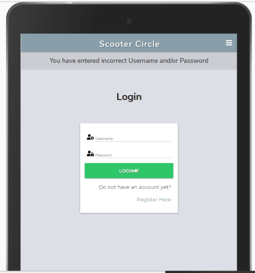
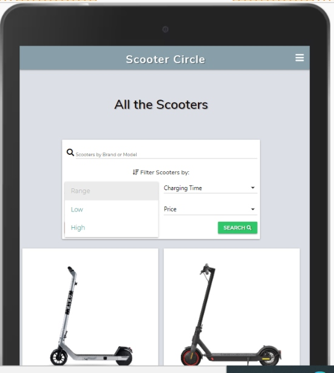
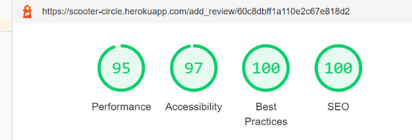

# Scooter Circle - Testing details

[Main README.md file](README.md)

[View deployed site here](https://scooter-circle.herokuapp.com/)

# Table of Content

[**Testing**](#testing)
   - [**Validation Results**](#validation-results)
   - [**Testing User Stories**](#user-stories-testing)
        - [**First Time User**](#first-time-user)
        - [**Returning User**](#returning-user)
        - [**Frequent User**](#frequent-user)
        - [**Business Goals**](#business-goals)
   - [**Further Testing**](#further-testing)
      - [**Device Compatibility Table**](#device-compatibility-table)
      - [**Elements on Every Page**](#elements-on-every-page)
      - [**Home Page**](#home-page)
      - [**Registration Page**](#registration-page)
      - [**Login Page**](#login-page)
      - [**Profile Page**](#profile-page)
      - [**Edit Review**](#edit-review)
      - [**Products Page**](#products-page)
      - [**View Product**](#view-product) 
      - [**Add Product**](#add-product) 
      - [**Edit Product**](#edit-product) 
      - [**Contact Page**](#contact-page) 
      - [**404.html**](#404.html)
      - [**500.html**](#500.html)
   - [**Google Lighthouse Testing**](#google-lighthouse-testing)
   - [**Cross Browser Compatibility Table**](#cross-browser-compatibility-table)
   - [**Bugs**](#bugs)

## Validation Results

- The W3C Markup Validator and W3C CSS Validator Services were used to validate every page of the project to ensure there were no syntax errors in the project.
- I have also used JSHints for JavaScript and jQuery code.
- PEP8 has been used to ensure Python code is fully compliant.

- [W3C CSS validation](https://jigsaw.w3.org/css-validator/)
  - The file passed without any errors

- [W3C Markup Validation](https://validator.w3.org/)
   - HTML code pass validation without major errors.
   - Type attribute has been removed from all texteria elements. 
   - Also `<a> type=submit` has been removed.

   - Profile Page
     - Missing closing `
` found and closed in the code
     - Submit button had two `type` attributes, removed one

   - View Product
     - Missing closing `
` found and closed
     - Also closed the moved closing tag after the `` statement

  - Final check has been completed for all pages, no errors or warnings have been found.

   #### All other pages have passed without errors.

- [W3C Link Checker](https://validator.w3.org/checklink)
   - All links have been checked and no errors have been detected, except on line 39 a link has returned an error. I have checked all the anchor links in the **modal** and changed them to buttons. Also, the issue was with the anchor link for the mobile navigation, I have added a `role="button"` to the anchor tag.
    - Also once I moved the code from Google fonts to the head of the document, a new error 404 has appeared in the link checker. Removed the link and added it to CSS file.
  
- [JSHint](https://jshint.com/)
   ### script.js 
      - No issues detected in this file.
      
   ### contact.js
      - JShint displaying a warning: "emailjs" one undefined variable.
      - Could not declare a variable for emailjs due to this variable is taken from the emailJS installation code.

- [PEP8](http://pep8online.com/)
   - The code passed through validation without errors

- [Extendclass](https://extendsclass.com/python-tester.html)
   - No syntax errors have been found

##### back to [content](#table-of-content)

## User stories testing

### Testing user stories from UX section of [README.md](README.md)

#### First Time User

1.	As a first time user, I want to understand what this site is about.

  - The site is designed with simple and easy to understand the content in mind.
  - Scooter logo in the header tells the user this site is about scooters.
  - A hero image tells the user the site is about scooters. 
  - A testimony positioned on the right-hand side explains to the user why electric scooters are 
  environmentally friendly and a fast way to travel.

2.	As a first time user, I want to view a collection of products available on site.

  - Once the user scrolls down the page, they presented with a welcome message
  - Telling the user what they can do on this site: 
    - View latest scooter models
    - View user reviews 
    - Add your review
  - Collection of products are presented in the carousel format, which moves to the next slide in 2 seconds intervals.

3.	As a first-time user, I want to be able to see more products and user reviews.

  - The user can view th full selection of scooters by clicking on the button, at the bottom of the page 
  *"View All Scooters"*
  - The first-time user will be redirected to the *Login* Page, where the message at the top of the page will tell them "You must be logged in to view this page". 
  - If the user does not have an account yet, they can click a button *Regester Here* at the bottom of the form and proceed to the registration page.
  - A first time user may register by filling up a simple form, which is asking for their username and password. 
  - Once the user is registered they will be redirected to their profile page.
  - Once the user is logged in, they can view all the products on the *Products* page
  - The products are presented in the form of cards, with a few categories and the number of reviews each product has.
  - Once a specific product has been selected, they may click on:
     - Product Image
     - Product Title
     - Link to *View Full Details* 
  - it will lead them to full product specification and individual products reviews.

4.  As a first-time user, I want to view the terms and conditions of the site.

  - The user may click on the button in the footer "Terms and Conditions" which will open a modal with full terms and conditions of the site. 
  - The user has 2 options, either press the button to "Close", which will close the modal.
  - Or the user may want to contact the site owners and ask more questions, the button "Contact" is presented next to "Close" button in the modal, which will redirect the user to the *Contact Page*.

##### back to [content](#table-of-content)

#### Returning User 

1.	As a returning user, I want to be able to login into my account

 - A returning user from *Home Page* may navigate to *Login Page* by pressing the login link at the top of the navigation bar.
 - A form is presented to the user which is asking for their username and password.
 - If the login attempt is successful they will be redirected to their profile page, where a welcome message will be displayed.
 - If one of the fields entries are inaccurate, the message will be displayed to let them know either username or password is incorrect. 
 - The login form will be cleared and the user may try again.

2.	As a returning user, I want to view the full specification of a product

  - As a returning user, once logged in can view full product details in a few ways: 
   - From the *Home* page by clicking on the image of the scooter in the carousel 
   - From the *Products* by clicking on: 
      - Product Image
      - Product Title
      - "View Full Details" link

3.	As a returning user, I want to add my review to the product

 - Once the user logs in to their account, they will be redirected to the profile page.
 - A user who have not submitted any reviews will be presented with the message:
   - "You have not reviewed any products yet!"
   - "Once you have reviewed some scooters, you will be able to manage your reviews here"
 - A link "View All Scooters" will direct them to the *products* page.
 - When the user selects a specific scooter and views product details, after the product description, an open form is presented to the user with a call to action "Review This Product".
 - The user may submit their review easily by filling in the form and pressing on the **Submit** button
 - Once the review has been submitted, the user will be redirected to their profile page. 
 - Feedback will be displayed to the user to let them know the "Your Review Has Been Added"
 - The user will be able to view their review inside their *Profile* page.

4.	As a returning user, I want to be able to filter the product by category 
  
  - A returning user, may filter products from the *Products* page by: 
    - Range
    - Charging Time
    - Speed 
    - Price 
  - The results are presented to the user in ascending or descending order.

5.	As a returning user, I want to be able to search for products by brand or model.

  - A returning user may use the search function, on the *Products* page, they may search products by brand or model
  - If the user searches for something that does not match any database query, the message will be displayed 
    - "No Results Found"
  - The user may choose to reset their search bar or filter options by pressing the "Reset" button, which will display all the products in the database again.

##### back to [content](#table-of-content)

#### Frequent User

1.	As a frequent user, I want to be able to view my reviews.

  - As a frequent user, upon successful login attempt, the user may view all their reviews on their *Profile* page 

2.	As a frequent user, I want to be able to update my review. 

  - A frequent user, can update their product review by clicking **Edit** in the review card.
  - The user will be redirected to the **Edit Review Page**, where the user will be presented with a pre-filled form with their review.
  - The user may delete or add some text to their review. 
  - Once the user presses the *Submit* button they will be redirected to their profile page
  - Feedback will be displayed:
    - "Your Review Has Been Successfully Updated"
  - The user may view an updated review on their *Profile* page.
  - If the user presses on the **Cancel** button when updating their review, they will be redirect them back to the *Profile* page and no changes will be made to their original review.

3.	As a frequent user, I want to be able to delete my review. 

  - From the *Profile* page, where all user reviews are displayed, the user may click on the **Delete** button for a specific review.
  - Once the button is pressed a modal will appear which will ask the user to confirm their selection
  - If the user presses **Yes** the review will be deleted from the database
  - The user will be informed 
    - "You review has been Deleted"
  - The deleted review will be deleted from the database and will not appear on the user profile page. 
  - If the user presses **No**, the modal will close and no changes will be made.

4.	As a frequent user, I want to read other user’s reviews.

  - The user may find out how many reviews each product has by going to the **Products** page
  - Scooter image and short specification is displayed in the card format for each scooter in the database
  - Inside the scooter card the total number of reviews are displayed, therefore the user will be aware of how many reviews each product has. 
  - The user can view the scooter reviews by clicking the "View Full Details" link, which will lead them to the *View Product* page, below add the review form, they will be able to view all other product reviews created by users. 
  - If the product does not have any reviews the message will be displayed: 
    - "No Reviews Added Yet!"
  - A call to action is displayed for the user to add their review with an anchor link to the add-review form.
  - At the bottom of the page the user has another link "Go Back To Products", which will them to the *Products* page.

5.	As a frequent user, I want to be able to contact the site and request other scooter models to be added to the list.

  - The user may contact the site owner by pressing on the link in the **Footer** which stays *Contact*.
  - The link will lead them to the *Contact Page*.
  - The user is welcomed with a short message, which explains to them how they can get in touch.
  - The user needs to fill in their: 
    - Name
    - Email
    - Query
  - Once all the input fields are filled in correctly the can submit the form.
  - If the input fields are not filled in correctly custom messages are displayed to guide the user through the process.
  - Once the form has been submitted, the alert is displayed to the user letting them know their message has been sent.
  - The automated email is sent to the user at the same time to let them know somebody will be in touch shortly.
  - The user now has an option at the bottom of the page to press the button "Go Back To Home Page"
  - Which will redirect the user to the *Home Page*
  - The user may choose to press the **Reset** button at any time to clear the form.

6.	As a frequent user, I want to know where I can purchase the product.

  - A frequent user may click on the **Buy This Scooter** button in the *View Product Page* below the product description. 
  - The link will take the user to a different site, which will be open in the new tab, letting the user have easy access back to the site.
  - The user may choose to purchase the product from the external site. 

7. As a frequent user, I want to be able to search for products by brand or model.

  - The user inside the *Products Page* has an option to search for product brand or model inside the search bar. 
  - The user is informed with pre-filled text, what should be their search criteria. 
  - The use is also given an option to filter the products by categories. 

### Business goals

1.	As a business owner, I want to provide a platform for users where they can view and add reviews for electric scooters.

  - The user may add scooter review when viewing full product details of a specific scooter modal.
  - At this point the user will also see the other user reviews at the bottom of the page.
  - The user will see how many reviews each product has by viewing all the products on the *Product* page. The total number of reviews presented to the user in the form of the card with product info.

2.	As a business owner, I want the user to be able to register with secure login details.

  - Scooter Circle has been designed to simplify the registration process for the user and ensure the user details are stored securely.
  - For the user to register they have to provide the username
  - Also have to type their chosen password twice, once both of the password fields match, the data gets stored in the database.
  - I have used the `generate_password_hash` method from `werkzeug.security` to hash the password in the database. 
  - The site owner who will have access to the database, will be able to see the username, however,will not be able to see the user password which is stored securely. 
  - Username may access their account only when username and password match the database, upon the login attempt.

3.	As a business owner, I want the client to be able to use the site easily on any device.

 - Scooter Circle was carefully planned and designed to be responsive and work well on mobile, tablet and desktop devices.

4.	As a business owner, I want to provide useful links to users where they can purchase products and earn an affiliate commission.

   - The link 'Buy This Scooter' has been added to each product in *View Product Page* which leads to an external company, where the product can be purchased. 
   - The [Pure Electric](https://www.pureelectric.com/) do offer affiliate partnership, however, this has not been implemented yet, as this project is for educational purposes at this moment in time.

5.	As a business owner, I want to be able to delete any reviews which I consider to be inappropriate or out of content.

  - An admin user has all the reviews visible on their profile page.
  - An admin user may delete any review which they find inappropriate or out of content.
  - An admin user does not have access to edit any of the reviews which have not been created by themselves.
  - This information is provided to the user in *Terms and Conditions Page*, which users have access to at all times by clicking a button in the footer.

6.	As a business owner, I want to be able to add additional new products to the site. 

  - An admin user has an *Add Product* page available to them.
  - A simple form which guides the Admin to fill in all the input fields which are required to display full product information on the site.
  - All the input fields have required attributes with custom feedback to the user, to ensure all the information is entered correctly.
  - Once the **Submit** button is pressed the product will be added to the database. 
  - The user will be redirected to the *Products Page* and feedback will be provided.
  - An admin user may clear the form at any time by pressing the button **Clear**

7.  As a business owner, I want to be able to edit or delete products.

  - An admin user, in the *Product Page* at the bottom of each product card, have two buttons to **Edit** or **Delete** a product.
  - If the *Edit* option is chosen, the admin user may update product information
  - If the *Delete* option is chosen, the admin user may delete the product from the database.
  - In the event of the *Delete* option, a modal will appear to ask the admin user to confirm their decision.

8.  As a business owner, I want to provide the user with search and filter functionality for products to enable easy access to the database.

 - Scooter Circle has been designed with user experience in mind, providing a platform for users, not only to view the products and product reviews but also search for a specific item.
 - Search functionality implemented to enable the user to search by scooter model or brand.
 - Also Filter function is implemented to let the user filter the results with their chosen category. 
 - Only 4 filter categories are available to the user at the moment, those categories have been chosen based on the importance of their value to the product..
 
##### back to [content](#table-of-content)

## Further Testing

### Manual (logical) testing of all elements and functionality on every page.

### Device compatibility table

| Pages    |<strong>Laptop</strong>|<strong>Ipad</strong>|<strong>IphoneX</strong> | <strong>Nokia2.4</strong> | <strong>Sumsung</strong> |
|----------|:---------------------:|--------------------:|------------------------:|-----------------------:|-----------------------:|
| Home     | &check; | &check;| &check;| &check;| &check;|
| Login   | &check; | &check;| &check;| &check;| &check;|   
| Register    | &check; | &check;| &check;| &check;| &check;|
| Products | &check; | &check;| &check;| &check;| &check;|
| View Product | &check; | &check;| &check;| &check;| &check;|
| Edit Product | &check; | &check;| &check;| &check;| &check;|
| Add Product | &check; | &check;| &check;| &check;| &check;|
| Edit Review | &check; | &check;| &check;| &check;| &check;|
| Profile | &check; | &check;| &check;| &check;| &check;|
| 400.html | &check; | &check;| &check;| &check;| &check;|
    
##### back to [content](#table-of-content)

### Elements on Every Page 

- All steps on the desktop were repeated on mobile, tablet and laptop screen sizes.

1. Navigation

- Hover over each link, confirm the hover effect works as expected.
- Click the Scooter Circle logo, confirm it takes the user to the home page.
- Click the Home link, confirm it takes the user to the home page.
- Click the Login link, confirm it takes the user to the login page.
- Click the Register link, confirm it takes the user to the register page.
- Log into Scooter Circle, confirm that the navbar no longer displays the Login or Register links, but does now display the Home, Products, Profile and Logout links instead.
  - Click on the Products link, confirm it takes the user to the products page.
  - Click the Profile link, confirm it takes the user to their profile page.
  - Click the Logout link, confirm the user is logged out and the navbar returns to the logged out configuration.
- Log into Scooter Circle with Admin user details
  - Confirm Add Product link appears on the navbar
  - Click on Add Product link, confirm it takes the Admin user to the add product page.
- Go to the bottom of the page to make sure the navigation bar is sticky.

- Mobile and Tablet view:
  - Confirm Scooter Circle logo appears in the middle of the navbar as expected
  - Confirm burger button appears on the right-hand side of the navbar
  - Click on the burger button, confirm the navbar is collapsed with links available for the home, login and register page.
  - Confirm Scooter Circle logo also appears in the expanded view.
  - Click on the Scooter Circle logo in the expanded view, confirm takes the user to the home page.
  - Followed the same steps as above to determine all the links are working.
  - Flip the tablet and mobile devices to check responsiveness.

2. Footer

  - Hovered over each link, confirmed background colour changed as expected.
  - Click on the contact link, confirmed it takes the user to the contact page.
  - Click on the terms and conditions button, confirm the modal appears with the terms and conditions of the site.
  - The footer is responsive on all window view sizes.

3. Preloader

 - Open any page and confirm that the preloader displays for 1 second as the page content is loaded.
 - Confirm the preloader animates as expected.

### Home Page

1. Hero Image
   - Confirm the background image loads in the reasonable time
   - Confirm the background image has a fixed position by scrolling up the page

2. Testimony
   - Starting from the desktop view the testimony has a Materialize margin to the right class. Featuring the man on the scooter in the background. 
   - View the page in the tablet view the testimony still has a margin to the right, the user is still able to see the view of the man on the scooter.
   - Chance the screen size to mobile view, the testimony appears in the middle of the page. 
   - The testimony background contains *RGBA* colour with allowed a semi-transparent background for the user to be able to see the background image.
   - On the mobile device, `margin-bottom` has been implemented to let the user see the background image once they scroll.

4. Welcome Message 
   - View the welcome message on all devices, confirm the message appears in the centre of the page.

3. Carousell 
   - View the carousels and confirm that they slide at a comfortable speed and interval.
   - Confirm the carousel if viewed in 3d format on tablet and large screen devices.
   - Point with the mouse on the carousel item, the pointer is displayed to let the user know the carousel item is clickable
   - Click on the image on the left, confirm the carousel stops and reverts to the image clicked
   - Click on the image on the right, confirm the carousel speeds up to the image clicked by the user
   - Move mouse away from carousel, confirm that carousel starts moving again.
   - Confirm each carousel image has the same width and height
   - Confirm each image has an `alt` description
   - Click on the carousel image and confirm it directs a non logged in user to the login page.
   - Login to Scooter Circle, click on any carousel image and confirm the link directs to the view product page of the product chosen to view.

  - Above tests have been repeated on tablet and mobile devices with a few exceptions:
    - Confirm the carousel is touch compatible by sliding the fingers to the left and right
    - On the mobile view confirm the carousel is viewed by one carousel item at the time.

5. Call to Action 
  - View all scooters call to action button appears at the bottom of the page.
  - Hover over the link, confirm background colour is changing as expected.
  - Click on the link, confirm it takes the not logged in user to the login page.
  - The custom message is displayed to tell the user they must be logged in to view this page. 
  - Login to Scooter Circle, click on the link, confirm it takes the user to the products page.
  - Confirm the link appears in the middle of the page on all screen size devices. 
  - All the steps above have been repeated on all screen sizes. 

### Registration Page
  - Go to create account page, confirm the form is displayed correctly.
  - Try to press register, without filling in the form. Confirm custom message appears to inform the user what they should enter.
  - Confirm the validation fields change colour to red for invalid entry.
  
  - Try to enter a username, but not the password and press register button, confirm the custom message appears to the user to enter a password and its parameters 
  - Try to create a new account that already exists (same username), confirm that the flash message appears at the top of the page informing the user that this account already exists.
  
  - Try to create a new account with a new username but with two passwords that do not match, confirm that the flash message appears at the top of the page informing the user that the passwords entered do not match.
  - Create a new account with a new username and 2 passwords that match, confirm all required fields turn green on successful validation.
  - Confirm the user has been redirected to their profile page with a custom message confirming their registration.
  - Confirm username is displayed on their profile page.
  - Click the login here button, confirm that it takes the user to the login page.
  - Above steps have been repeated on mobile and tablet devices. No changes to this page layout across the different screen sizes.
  - Confirm the navbar has changed based on user access. 
  

##### back to [content](#table-of-content)

### Login Page
- Go to the login page, confirm that the login form is displayed correctly.
- Try to submit the form without entering any details, confirm custom feedback is displayed, which tells the user to enter a valid username.
- Enter the username, but not the password, confirm custom feedback is displayed, telling the user to enter a valid password. The input field also turns red on invalid input.

- Try to login with a username or password which does not exists in the database, confirm the flash message is displayed letting the user know that some of the details entered are incorrect.

- Try to login using the correct username and password, confirm that the input fields change the colour to green on the valid entry.
- Confirm that the logged-in user is redirected to their profile page.
- Log out, then try to log in the using correct username and password, confirm that this is successful.
- Confirm *Register Here* link takes the user to the register page.
- Above steps have been repeated on mobile and tablet devices. No changes to this page layout across the different screen sizes.
- Confirm the navbar has changed based on user access.
- As a logged-in user, try to access the Login Page by modifying the URL, confirm the user has been redirected to their profile page.

### Profile Page

- Try accessing the profile page by typing the '/profile/username' to the end of the URL, confirm the user is getting redirected to the login page and a flash message is displayed informing the user they must be logged in to access this page.
- Try accessing the profile page by typing the '/profile/admin' to the end of the URL, confirm the user is getting redirected to the login page and a flash message is displayed informing the user they must be logged in to access this page.
- Login with valid login details, confirm welcome message is displayed using the correct username for identification.
- Confirm the circle in the middle of the page contains the correct username.

#### Users who have added reviews: 
  - Heading is displayed in the middle of "Your Scooter Reviews"
  - Reviews: 
    - The reviews are displayed in the form of the card, with equal height to create consistency.
    - Confirm the reviews are displayed on the profile page which has been created by the username used to access the account

    - Review cards are displayed in 3 cards in the row on the large screen view, 2 cards in the row on the tablet screen view and 1 card taking up the whole row on the mobile screen view.
    - Hover over the edit and delete button, confirm the background colour is changing as expected.
    - Click on the edit button, confirm the link takes the user to the edit-review page
    - Click the delete button, confirm a modal appears asking the user to validate their decision.

    - If the user presses no, the modal closes and not changes are made to the database.
    - If the user presses yes, the review is deleted from the database. 
    - Confirm the user gets redirected back to the profile page, where the review which they have deleted is no longer available. Flash message appears on the profile page to provide feedback to the user.

  #### Users who have not created any reviews yet: 
    - The heading displayed on the profile page: "You have not reviewed any products yet!"
    - A short message tells them what they can use their profile page for
    - A link "View All Scooters", when hovered changed colour as expected.
    - Confirm the link takes the user to the products page

  #### Admin user:
    - Login with admin login details
    - Admin can view all the reviews in the database created by different users
    - Admin can edit or delete their reviews 
    - Confirm no edit button is available for admin user to edit, user reviews
    - Confirm only the delete button is available for admin user to delete other users reviews if found inappropriate.

##### back to [content](#table-of-content)

### Edit Review

- From the Profile page, click the edit button in the review card, confirm it takes the user to edit_review.html
- Hover over Submit and Cancel button, confirm the background colour changes as expected.
- Confirm the correct text is displayed.
- Delete all the text from the texterea element and press submit button, the message is displayed to tell the user the field must contain text.

- Try to delete the scooter model, confirm it is not possible, as the input field contains an attribute *read-only*
- Edit the review and press submit, confirm the user is being redirected back to their profile page where they can view their edited review.
- The flash message is displayed confirming to the user "Your Review Has Been Successfully Updated"

- Press the cancel button on the edit_review page, confirm the user is being redirected to the profile page, no changes have been made to the review and the database.

##### back to [content](#table-of-content)

### Products Page

- As a not logged in user, try to type products page by editing the URL, confirm the user is being redirected to the login page with a message telling the user they must be logged in to view this page.
- Login into Scooter Circle and click the products link in the navbar, confirm it takes the user to the correct page.
- Search and filter options are displayed in the same form element.

- Search bar: 
  - Confirm the search input field contains search icon and label, telling the user what they can search for.
  - Press the Search button with an empty search bar, confirm all the products are still displayed on the page.
  - Type any words which the scooter model or brand may contain, confirm the correct results are returned. 
  - Confirm all the products are displayed containing the search criteria.
  - Try to search for something which does not match the scooter model or brand, confirm no products are displayed and message displayed to the user telling them their search criteria was not met.
  - Press the Reset button, confirm all scooters in the database are displayed

- Filters: 
  - Filters are displayed below the search bar.
  - At this moment in time the user is not able to combine the search and filter functionality, therefore the user may either search or filter products. 
  - The user may filter products by 4 different categories (Range, Charging Time, Speed, Price), these options are displayed side by side on the large screen view. On the mobile and tablet, the filter options are displayed by 2 in a row.
  - The user may choose to filter products by "Range"- drop-down option is available "Low" or "High", confirm when the user picks "low" option all the product returned displaying ascending range value.
  - If the user presses the "high" option, all the products are returned displaying descending range value.
  - Repeat the above steps for all filter options on mobile and tablet screen views.
  - Press the Reset button, confirm the filters have been cleared and all scooters in the database are displayed on the page.

 | 

- Product Card
  - Each scooter are displayed in the card format
  - Confirm all cards have fixed height to give the user an equal view of the page
  - Large screen view - 3 cards in the row
  - Tablet view - 2 cards in the row
  - Mobile view - 1 card in each row
  - Hover over each product card and confirm each card stands out `class = "hoverable"` from **Materialize** library.
  - Each card contains a scooter image, product_model name, 4 main product categories (the same as filters), the total number of reviews each product contain and a link to the full product details.
  - Confirm the image is loading without delays
  - Hover each image in the dev tools to confirm the *alt* info is present
  - Click on each image and confirm the link takes the user to the *view_products* page
  - Click on each product title and confirm the link takes the user to the *view_products* page
  - Hover over the product title, confirm the background colour and text changes colour, as expected.
  - Hover over scooter category icons and confirm each icon contains a description, when the user moves the mouse away the description disappears.
  - The icon which appears on the first row, displays the description at the top of the icon
  - The icons which appear on the second row, display a description at the bottom of the icon
  - The only icon which does not have a description is **£** which is self-explanatory.
  - The price icon contains a tooltip feature, which tells the user the price may vary
  - Each card contains the total number of product reviews (every time the user adds a review the total number increases by 1, every time the user deletes the review the total number of reviews decreases by 1.)
  - If the product does not have reviews yet, "0 user reviews" is displayed.
  - Hover over the "View Full Details" link and confirm the background colour changes as expected, also the link takes the user to the correct page, showing the full details of the product chosen by the user.

   |   | 

  - View for Admin user
    - Login with admin user details
    - Product card displays 2 button at the bottom of each card to **Delete** or **Edit** product.
    - Hover over the buttons to confirm the background colour changes as expected.
    - Press the delete button, confirm modal appears to ask the user to confirm their desicion.
    - The modal works exactly in the same way as delete review in the profile page.
    - Feedback is presented to the Admin user when the product is successfully deleted
    - Press Edit button, confirm the link takes the user to the edit_product page and all the correct information is displayed.
  
  

### View Product

- The user may access this information in 2 ways: 
  1. As logged in user, coming from Home Page, click on any image in the carousel and confirm it takes the user to the selected scooter view product page.
  2. From Products Page, click on the link "View Full Details", Product Title or Product Image, in any of the products cards and confirm the correct information is displayed for the product chosen.

- View Product page contains scooter model name as a title 
- The image is positioned to the left side of the page.
- Inspect the image to confirm the alt information is preset and displayed correctly.
- Product Categories are displayed on the right-hand side of the page, beside the scooter image.
- Each category has an icon and description beside it, except the "£" icon as it is self-explanatory.
- The price icon contains a tooltip, the same as the product card.
- Hover over the tooltip, confirm the background colour changes as expected and the correct information is displayed.
- Description of the product is displayed after the image and categories.
- Hover over the "Buy this product" link and confirm the background colour changes as expected.
- Click on the link and confirm it opens in the new tab, linked to the correct product

- Mobile view: 
  - On the small screen devices, the image takes a full-width row and categories information is displayed below the image.

- Add Product Review
  - This section is presented to the user with a call-to-action title "Add Your Review"
  - A form is populated with scooter model name and empty texterea field for the user to add their review.
  - Try to delete the product model name and confirm it is not possible, as the input field is set to "read-only"
  - Try to submit an empty form and confirm an alert appears to tell the user to fill in the empty field.
  - Try to type only one character and submit the form, confirm custom feedback is given to the user, which tells the user the requirements.
  - Type some text in the form and press the Clear button, confirm the form is cleared.
  - Add a product review and press submit, confirm it redirects the user to their profile page with a flash message providing the feedback to the user.
  - Users can see the new review which they have just added on their profile page.
  - Confirm the total number of reviews have been updated in the products card and database.

 | 

  - User Reviews
    - If a product contains user reviews:
      - Keeping with the style of the site, the reviews are displayed using card components with the same layout as product cards across screen devices.
      - Each card contains the product model name as a title
      - User review 
      - Created by: username 
      - Each review card has a fixed height

    
    - No reviews available for this product:
      - A message displayed to the user telling them "No Reviews Added Yet!"
      - A call to action asking the user to add their own review with an anchor link to the add review form.
      - Click on the anchor link to confirm the add review form is displayed

  - Call to action link at the bottom of the page prompts the user to go back to the products page.
  - Click on the link and confirm the link takes the user to the correct page.
  - Above steps have been repeated across all screen devices
  
##### back to [content](#table-of-content)

### Add Product 
  - This page is available for Admin user only, which enables an Admin user to add products to the database using the site
  - Try to amend the url and add add_product to the end, confirm the user is being redirected to the login page and feeback is provided via flash message, which tells the user they do not have access to this page.

  - Login with Admin login details
  - Using the navbar, navigate to Add Product page
  - A form is presented to the user with required input fields which need to be filled in 
  - Each input field contains an icon and a label, to guide the user what is required
  - Try to submit an empty form, an alert message appears as expected to let the user know what information is missing
  - Type text in to any of the following input fields:
    - Price
    - Range
    - Speed
    - Motor
    - Load
    - Wheel Size 
    - Battery Charge
    - Scooter weight
  - Confrim it is not possible to type text on any of the above input fields, as type attribut is set to number
  - Type something into Affiliate link or Scooter image field, confirm the validation field turns red and when trying to submit the form an alert shows telling the user is expecting an URL.
  - In the scooter descripiton field type 4 letters, confirm the alert shows telling the user to enter at least 50 characters.
  - Hover over submit and clear button to confirm the background colour changes as expected.
  - Press Clear button, confirm the form has been cleared
  - On valid entry, confirm the input field changes colour to green and on invalid entry confirm the input field changes colour to red.
  - Once all the fields have been correctly field in, press Submit button, confirm the user is being redirected to products page, where they are able to view their new product entry.
  - Feedback is given to the user telling them the product has been added to the database. 

  - User reviews for new product entry automatically set to 0.
  - Now the Admin user is able to edit or delete this product if needed.

 | 

##### back to [content](#table-of-content)

### Edit Product 

- This page is only for Admin user, who is able to esily edit product using the website.
- Login with Admin details, from the products page click Edit button in any product card, confirm the correct information is displayed for selected product.
- Try to delete any input field and submit the form, the user is being redirected to view product details page for the selected product with original value still in place, no changes have been made in the database
- Try to amend the any value and submit the form, by pressing Edit button, confirm the user is being redirected to the products page as expected with feedback displayed to the user.
- All custom validations have are identical to add product page, manual validation has been performed in the same way as add product page.
- Hover over the 2 buttons in the end of the form, confirm the background colour changes as expected.
- Press Cancel button, the user is being redirected back to the products page, no changes are made in the database.
- Repeated the following steps for tablet and mobile view. 

##### back to [content](#table-of-content)

### Contact Page

- Click on the link in the footer "Contact" which leads the user to the contact page
- The user is presented with a simple form to fill out 
- Click and try to submit an empty form, a custom message appears which asks the user to enter their name
- Enter the name, but not an email and try to submit the form again, a message appears asking the user to enter thier email address
- Enter name, email but not message and try to submit the form, message appears telling the user they must enter at least 10 characters.
- Confirm the input field changes the colour to green on valid entry and to red on invalid entry
- Complete all the required input fields and submit the form, submit button changed value to "Sending..." and alert appears to tell the user the message has been sent.
- The form is cleared and submit button is disabled, with the value "Sent"
- Automated email is sent to the user to tell them the message has been recieved and somebody will be in touch soon.
- Automated email is sent to the site owner telling them they recieved a new message with username, email and enquire.
- Now the user has an option to press the button below "Go back to home page", which as expected takes user to the home page.
- Repeated the following steps for tablet and mobile view. 
- The result was satisfactory across the different size devices and browsers.

 | 

##### back to [content](#table-of-content)

### 404.html Page

- Starting at the desktop view, typed some random characters after the URL and custom 404 page is displayed.
- Hover over the button which leads to the home page and the color has changed. 
- Clicked on the button and the link has diverted the user to the home page. 
- Repeated the following steps for tablet and mobile view. 
- The result was satisfactory across the different size devices and browsers. 

### 500.html Page

- Custom server error page has been designed to provide feedback to the user
- The page is identical to 404.html and also provides the link for the user to return to home page
- To test this page I had to take the following steps
  1. inside the app.py file `from Flask import abort`
  2. add abort(500) before a return or redirect in any route
    - `@app.route("/index")
       def index():
       """
      Find Products from Mongo db collection
      """
      products = mongo.db.products.find()
      abort(500)
      return render_template("index.html", products=products)`
  
  - I have used the above code to test my custom 500.html, then removed abort from import in Flask and abort(500) within the route

##### back to [content](#table-of-content)

## Google Lighthouse Testing

- To get an accurate report all the pages have been viewed using an incognito window.

1. Home Page

- Initial issues with performance score of the site, following the google lighthouse report and advice I have added `rel="preconnect"` and `rel="preload"` to externam cdns. Informaiton for this found on [web dev](https://web.dev/uses-rel-preconnect/?utm_source=lighthouse&utm_medium=devtools)
- Also added `loading="lazy"` to carousel images to imporve performance
- I have noticed the preloader added to the side does slow down the speed of the site, however I have decided not to remove it. 
- Also added specific width and height to carousel images.

2. Registration Page 

- Added link to google fonts in the head of the document to increase the speed

3. Login Page

4. Profile Page

5. Edit Review

- Heading elements are not in a sequentially-descending order, changed the mobile logo from h3 to h2 element

6. Products Page

- Heading elements are not in a sequentially-descending order, changed the filter heading to a paragraph and product model name in the card to <h3>.
- Also google has failed input for drop down, materialize renders select elements into a div and adding an input field, which does not contain id, therefore I was not able to add a label for the input field.

7. View Product

- Form elements do not have labels, the error was caused due to an empty label element. Fixed it by adding text to the label between closing and opeting

8. Add Product

- Select element shows as a failing element due to Materialize class
- Not enough contrast between background and foreground colours

9. Edit Product

- I have moved google font to the head element and removed import from style.css to improve performance

10. Contact Page

- No issues needed fixing on this page.

##### back to [content](#table-of-content)

### Cross Browser Compatibility Table 

| Pages    | **Google Chrome** | **Edge**  | **Safari**| **Firefox**
|----------|:-----------------:|-----------:|---------:|-----------:|
| Home     |&check;            | &check;   | &check;| &check;|
| Products    |&check; | &check;| &check;| &check;|
| View Product   |&check; | &check;| &check;| &check;| 
| Profile    |&check; | &check;| &check;| &check;|
| Login    |&check; | &check;| &check;| &check;|
| Register    |&check; | &check;| &check;| &check;|
| Edit Review    |&check; | &check;| &check;| &check;|
| Add Product    |&check; | &check;| &check;| &check;|
| Edit Product    |&check; | &check;| &check;| &check;|
| Contact  |&check; | &check;| &check;| &check;|
| 404.html |&check; | &check;| &check;| &check;|

- Browser compatibility test has been successful and all browsers tested displayed the information correctly. Used [Lampada](https://app.lambdatest.com/console/realtime) to help with cross browser compatability

##### back to [content](#table-of-content)

## Bugs

### Add Review and Edit Review 
  - Whilst testing user stories, I realized the user is able to amend the product_model name, which would lead to review added not matching any products and only appearing on the user profile page. 
  - I have fixed it by including `readonly="readonly"` attribut to the **input** element.

### Navbar
  - Little but noticed during testing, Scooter Circle logo, when hovered, was displaying extra height. 
  - Fix: remove hight property in css

### Home Page
  - During manual testing noticed that call to action button at the bottom of the page was not big enough and the text overlayed the background colour of the button, especially on the iPhone.
  - Fix: removed extra classes from the link and re-used the link style from the *Contact Page*, which solved the issue

### Filter functionality
  - I came across an issue, when sorting price in filter function. All the filters were working except the price, which was not returning the values in order.
  - Fixed the issue by changing the data type the database was reasiving, originally it was a string, however I changed it to intigure, which solved the problem.
  - I have also ensured when the new product is created the data recieved by the database is intiger by wrapping the value from the input field.
    - `"product_price": int(request.form.get("product_price"))`

### Add Product  and Edit Product Form Validation 
  - When testing and validating user input the custom validation was not showing up as expected.
  - Fixed: using an alert: 
    - `oninvalid="alert('Please enter a scooter range using numerical value only!')"`

### Edit Product 
  - Error found whilst testing, the `product_reviews` where resetting to 0 when updating a product.
  - Fix this error by submitting a value from the database:
    - `"product_reviews": product['product_reviews']` 

##### back to [content](#table-of-content)